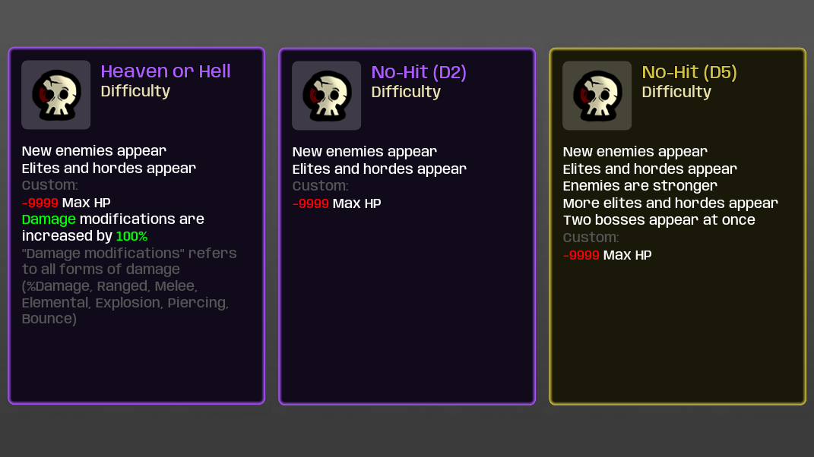

# Darkly77 - Custom Difficulty Modes

Adds some hardcore custom difficulty modes:

- D2 - Heaven or Hell
- D2 - No-Hit
- D5 - No-Hit
- D5 - No Stand-Still

"Heaven or Hell" is a no-hit difficulty, but you also gain +100% Damage modifications.

## Notes for Modders

Custom difficulties behave similarly to items, but they are not added to `RunData.items` (unlike items/characters).

They apply their effects by adding them to `RunData.effects`, which makes the effects permanent for the current run.

You can find where the current difficulty is used in the vanilla code by searching for `get_current_difficulty` (which is defined in *run_data.gd*).

### Value

The `value` of a difficulty's *DifficulyData* resource sets the danger level, which in turn affects both the type of enemies that can be spawned, and the number of elites/hordes. See these parts in vanilla:

- `init_elites_spawn` (*run_data.gd*) - Sets elite spawns based on difficulty `value`.
- `_physics_process` (*wave_manager.gd*) - Sets group spawns, via `RunData.get_current_difficulty`.

This is important to note because this is different to how every other gameplay-impacting effect is handled, which uses actual effects (ie. `RunData.effects["effect_key"]`).
 
**Notes:**

- `value` must be >= `0`, or nothing will spawn. Using `-1` makes waves empty.
- If a player completes your custom difficulty, then the next difficulty above that will be unlocked. *So try not to make them too easy* 😄

### Showing the Difficulty

By default, the custom difficulty isn't shown anywhere. For example, the pause menu still says "Danger 3" if `value` is `3`, even if you're using a custom difficulty.

The effects *are* saved on your run, so if you quit and reload then they're still there, but there's no indication of which custom difficulty you're currently using.

One approach to fix this would be to make it so that custom difficulties add an item to your inventory, and that item has all the special effects:

- You can still list the effects in the difficulty's effects with *null_effect.gd*, using custom translated strings.
- Then you can use a starting item effect to add your custom item.
    - Vanilla's `effect_starting_item` doesn't work for this, because it adds items after the weapon selection, which is too soon for the difficulty's item to be added.
    - However, BFX now offers custom effects that *can* do this:
        - `bfx_starting_difficulty_item`
        - `bfx_starting_difficulty_weapon`
        - [See here](https://github.com/BrotatoMods/Brotato-BFX#custom-difficulties) in the BFX readme for more info.

## Screenshots

